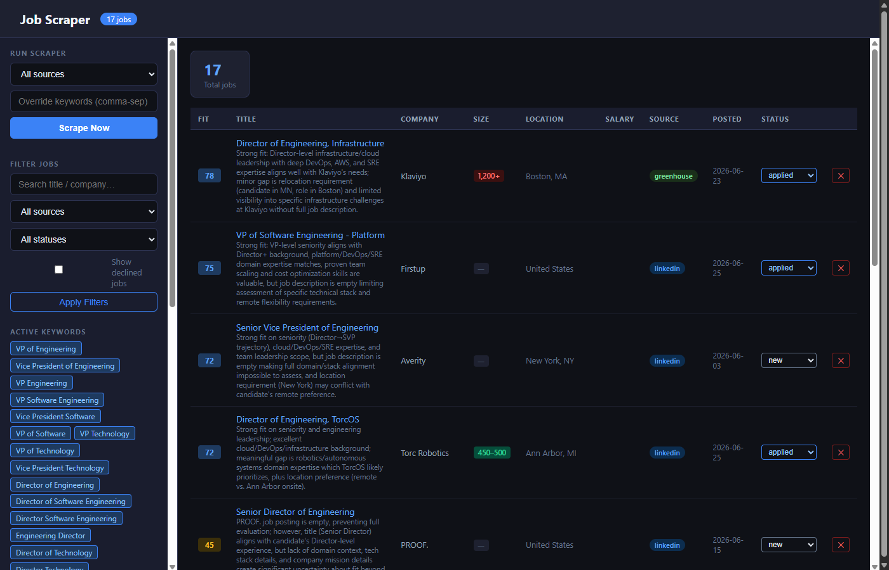

# AI Job Search Dashboard

A locally-hosted job scraper and ranking dashboard targeting VP / Director-level Software Engineering leadership roles at remote technology companies. Scrapes multiple sources, scores each posting against your resume using Claude AI, and lets you track applications in one place.



---

## Features

- **Multi-source scraping** — LinkedIn, Greenhouse ATS (~35 companies), Indeed, Glassdoor, Remote OK, We Work Remotely, Hacker News
- **Remote-only filtering** — LinkedIn fetches full job descriptions and drops any role that mentions hybrid/on-site requirements
- **AI fit scoring** — each job is scored 0–100 against your resume by Claude Haiku, with a one-line reason and estimated company headcount
- **Application tracking** — status workflow: New → Interested → Applied / Rejected / Ignored / Declined
- **Decline with notes** — record why you passed; review notes at `/rejections` to tune keyword filters
- **Daily auto-scrape** — Claude Code scheduled task fires at 9 am every day (requires the app to be open)
- **Live scrape progress** — spinner + auto-refresh; no manual page reload needed

---

## Prerequisites

| Requirement | Version |
|---|---|
| Python | 3.11 or 3.12 recommended (3.14 has known wheel issues with some packages) |
| pip | any recent version |
| Anthropic API key | for AI scoring — get one at console.anthropic.com |

---

## Local Deployment

### 1. Clone / download the project

```bash
git clone <repo-url>
cd AI_Job_search
```

### 2. Create and activate a virtual environment

```bash
# Windows
python -m venv .venv
.venv\Scripts\activate

# macOS / Linux
python -m venv .venv
source .venv/bin/activate
```

### 3. Install dependencies

```bash
pip install -r requirements.txt
```

### 4. Add your Anthropic API key

Create a `.env` file in the project root:

```
ANTHROPIC_API_KEY=sk-ant-api03-...
```

> Scoring is optional — the dashboard works without an API key, jobs just won't be ranked.

### 5. Add your resume

Replace `resume.txt` with your own resume text. This is the profile the AI scores jobs against. Plain text extracted from a PDF works well.

### 6. Start the server

```bash
python main.py
```

Open **http://127.0.0.1:8000** in your browser.

---

## Usage

### Running a scrape

Click **Scrape Now** in the sidebar. A spinner shows while scraping is in progress; the page auto-reloads when done. LinkedIn now fetches full job descriptions to filter out hybrid/on-site roles, so a full scrape takes a few minutes.

To scrape a single source, select it from the dropdown before clicking Scrape Now.

### Scoring jobs

Scoring runs automatically after each scrape if `ANTHROPIC_API_KEY` is set. To manually score any unscored jobs, click **Score Unscored Jobs** in the sidebar.

Score badges:
- 🟢 **80–100** — strong match
- 🔵 **65–79** — good match
- 🟡 **45–64** — partial match
- 🔴 **< 45** — weak match

Company size badges:
- 🟢 **100–500** — sweet spot
- 🔵 **500–1000** — works well
- 🟡 **< 100** — startup (preferred over large)
- 🔴 **1000+** — right opportunity needed

### Tuning results

Edit `config.py` to adjust which jobs are collected:

- **`KEYWORDS`** — job titles to search for
- **`EXCLUDE_KEYWORDS`** — terms that disqualify a posting
- **`SCRAPE_INTERVAL_MINUTES`** — how often the in-process scheduler re-runs (set to `0` to disable)
- **`MAX_PAGES_PER_SOURCE`** — controls how many result pages are fetched per source per run

After declining jobs, visit **http://127.0.0.1:8000/rejections** to review your notes and identify patterns worth adding to `EXCLUDE_KEYWORDS`.

### Adding more Greenhouse companies

Edit the `GREENHOUSE_COMPANIES` list in `scrapers/lever.py`. The slug is the company's Greenhouse board token — usually visible in their jobs page URL (`boards.greenhouse.io/<slug>`).

---

## Project Structure

```
AI_Job_search/
├── main.py              # Entry point — starts uvicorn
├── app.py               # FastAPI routes and lifespan hooks
├── config.py            # Keywords, intervals, user-agent (edit this to tune)
├── database.py          # SQLite operations (jobs.db created on first run)
├── scheduler.py         # Scrape orchestration + APScheduler
├── scorer.py            # Claude Haiku scoring logic
├── resume.txt           # Your resume — used as scoring profile
├── scrapers/
│   ├── __init__.py      # ALL_SCRAPERS registry
│   ├── linkedin.py      # LinkedIn guest API + description fetch
│   ├── lever.py         # Greenhouse ATS (~35 companies)
│   ├── indeed.py
│   ├── glassdoor.py
│   ├── remoteok.py
│   ├── weworkremotely.py
│   └── hackernews.py
├── templates/
│   ├── index.html       # Main dashboard
│   └── rejections.html  # Decline notes review
├── requirements.txt
├── .env                 # API key (not committed)
└── jobs.db              # SQLite database (created on first run)
```

---

## Scheduled Daily Scrape

A Claude Code scheduled task (`daily-job-scrape`) runs all scrapers at 9 am daily. The task is configured in Claude Code's scheduler — **the app must be running** for it to fire.

To view or modify the schedule, open Claude Code and check the scheduled tasks list.
